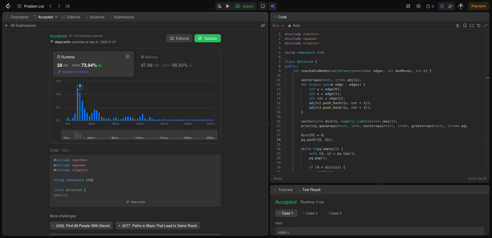
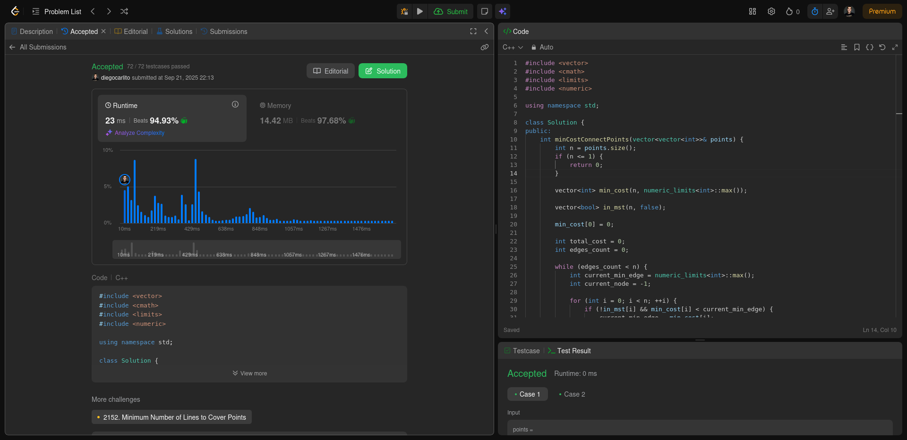

# Grafos2_LeetCode-D17

**Número da Lista**: 2 
**Conteúdo da Disciplina**: Grafos 2 

## Alunos
|Matrícula | Aluno |
| -- | -- |
| 22/1007690  |  Diego Carlito Rodrigues de Souza  |
| 22/1008300  |  Marcos Antonio Teles de Castilhos |

## Sobre 
O projeto possui como tema central a resolução de exercícios de programação competitiva com o tema de Grafos, utilizando a plataforma de juiz online LeetCode.

## Exercícios

| Exercício | Nível  | Vídeo Explicando |
|---------|--------|------------------|
| [882. Reachable Nodes In Subdivided Graph](https://leetcode.com/problems/reachable-nodes-in-subdivided-graph/description/) | Difícil | [Vídeo](https://youtu.be/jdRSrnFY7b8?feature=shared) |
| [1584. Min Cost to Connect All Points](https://leetcode.com/problems/min-cost-to-connect-all-points/description/) | Médio | [Vídeo](https://youtu.be/jdRSrnFY7b8?feature=shared&t=128) |
| [743. Network Delay Time](https://leetcode.com/problems/network-delay-time/description/) | Médio | [Vídeo](https://youtu.be/jdRSrnFY7b8?feature=shared&t=236) |
| [778. Swim in Rising Water](https://leetcode.com/problems/swim-in-rising-water/description/) | Difícil | [Vídeo](https://youtu.be/jdRSrnFY7b8?feature=shared&t=460) |

[Vídeo explicando todos os exercícios](https://youtu.be/jdRSrnFY7b8)

## Screenshots

### Exercício 01 - [882. Reachable Nodes In Subdivided Graph](https://github.com/projeto-de-algoritmos-2025/Grafos2_LeetCode-D17/blob/master/882_Reachable_Nodes_In_Subdivided_Graph/solution.cpp) - Difícil

  
   
  <a href="https://leetcode.com/problems/reachable-nodes-in-subdivided-graph/submissions/1778556100">
    Visualizar submissão do exercício 882
  </a>

### Exercício 02 - [1584. Min Cost to Connect All Points](https://github.com/projeto-de-algoritmos-2025/Grafos2_LeetCode-D17/blob/master/1584_Min_Cost_to_Connect_All_Points/solution.cpp) - Médio

  
   
  <a href="https://leetcode.com/problems/min-cost-to-connect-all-points/submissions/1778566943">
    Visualizar submissão do exercício 1584
  </a>

### Exercício 03 - [743. Network Delay Time](https://github.com/projeto-de-algoritmos-2025/Grafos2_LeetCode-D17/blob/master/743_Network_Delay_Time/solution.cpp) - Médio

  
   
  <a href="https://leetcode.com/problems/network-delay-time/submissions/1779299133/">
    Visualizar submissão do exercício 743
  </a>

### Exercício 04 - [778. Swim in Rising Water](https://github.com/projeto-de-algoritmos-2025/Grafos2_LeetCode-D17/blob/master/778_Swim_in_Rising_Water/solution.cpp) - Difícil

  
   
  <a href="https://leetcode.com/problems/swim-in-rising-water/submissions/1779416905/">
    Visualizar submissão do exercício 778
  </a>

## Instalação 
**Linguagem**: C++ 

## Verificação

Para validar se a solução implementada está correta, submeta o código no **[LeetCode](https://leetcode.com/)** e verifique se o exercício foi aceito. Cada solução contém o link para a descrição completa do problema no próprio código-fonte.
